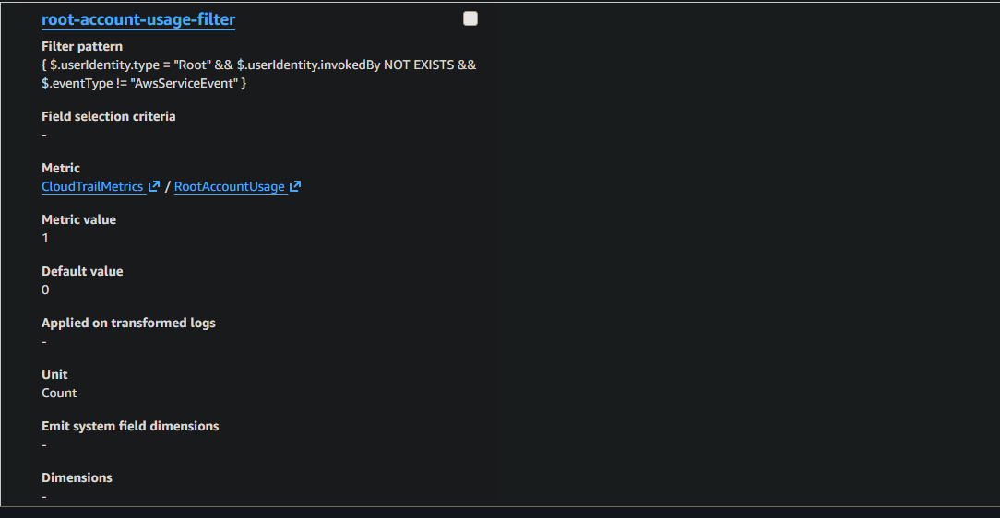
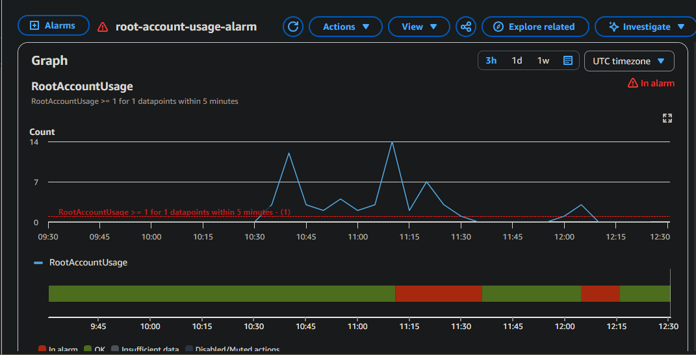
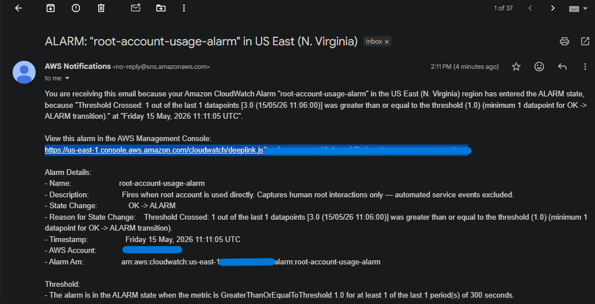

# CloudTrail-CloudWatch-Root-Detection

> Detecting unauthorized root account usage in AWS using CloudTrail, CloudWatch Logs, metric filters, and SNS alerting — built as part of a hands-on cloud security engineering roadmap.

---

## Overview

The AWS root account is the single most privileged identity in any AWS environment. It bypasses every IAM policy, permission boundary, and guardrail configured in the account. There is no legitimate operational reason for root to be used after initial account setup — any root activity is an immediate red flag.

AWS provides no native alert for root account usage out of the box. This project builds that detection pipeline from scratch: a fully automated signal chain that captures every direct human root interaction and delivers a real-time email notification within minutes.

---

## Architecture — Signal Chain

```
Root Account Login
       │
       ▼
  CloudTrail
  (Records every API call — who, what, where, when)
       │
       ▼
  CloudWatch Logs
  (Receives log stream in real-time)
       │
       ▼
  Metric Filter
  (Scans logs continuously — matches root login pattern → increments metric)
       │
       ▼
  CloudWatch Alarm
  (Watches metric — fires when RootAccountUsage >= 1 in 5-minute window)
       │
       ▼
  SNS Topic
  (Publishes notification to all subscribers)
       │
       ▼
  Email Notification
  (Alert delivered within minutes of root login)
```

---

## What Was Built

### 1. CloudTrail — The Forensic Ground Truth

A trail named `atlas-cloudtrail-week7` was created to capture all management events across the AWS account.

**Key configurations:**

| Control | Setting | Why It Matters |
|---|---|---|
| S3 log delivery | Enabled | Long-term forensic archive — retained beyond the default 90-day event history |
| CloudWatch Logs integration | Enabled | Real-time log delivery — makes logs queryable by metric filters and alarms |
| SSE-KMS encryption | Enabled | Logs encrypted at rest — unreadable even if S3 bucket is compromised |
| Log file validation | Enabled | Cryptographic proof of log integrity — SHA-256 hash chain signed by AWS. Any post-delivery modification breaks the chain and is detectable |
| Management events | Read + Write | Captures all API calls including console logins, IAM changes, and resource operations |

**Log file validation** deserves specific attention. CloudTrail creates an hourly digest file containing SHA-256 hashes of every log delivered that hour, chained to the previous digest. If an attacker modifies a log to cover their tracks, the hash breaks. If they delete a log, it shows as missing from the chain. If they tamper with the digest, the AWS signature fails. This makes CloudTrail logs forensically defensible.

---

### 2. CloudWatch Metric Filter — The Detection Layer

A metric filter was created on the `atlas-cloudtrail-logs` log group to continuously scan incoming CloudTrail events for root account activity.

**Filter pattern:**

```
{ $.userIdentity.type = "Root" && $.userIdentity.invokedBy NOT EXISTS && $.eventType != "AwsServiceEvent" }
```

**Pattern breakdown:**

| Condition | Purpose |
|---|---|
| `$.userIdentity.type = "Root"` | Matches only root account actions |
| `$.userIdentity.invokedBy NOT EXISTS` | Excludes automated AWS service actions — prevents false positives from services acting on behalf of root |
| `$.eventType != "AwsServiceEvent"` | Excludes broader platform-level events generated internally by AWS |

All three conditions must be true simultaneously. The filter fires **only on direct human root interactions** — clean signal, no noise.

**Metric configuration:**

| Field | Value |
|---|---|
| Metric namespace | `CloudTrailMetrics` |
| Metric name | `RootAccountUsage` |
| Metric value | `1` (each match increments by 1) |
| Default value | `0` (reports zero when no match — prevents null gaps in alarm evaluation) |

> *Screenshot: Metric filter configured on the CloudTrail log group*



---

### 3. CloudWatch Alarm — The Trigger

An alarm named `root-account-usage-alarm` watches the `RootAccountUsage` metric and fires the moment any root activity is detected.

**Alarm configuration:**

| Field | Value | Reasoning |
|---|---|---|
| Statistic | Sum | Counts discrete events — one login = Sum of 1. Average was intentionally avoided: it divides the count across the evaluation period, producing fractional values that never cleanly breach a threshold of 1 |
| Period | 5 minutes | Short enough for rapid detection, standard for CloudWatch evaluation |
| Threshold | >= 1 | Zero tolerance — there is no legitimate reason for root to be used in normal operations |

> *Screenshot: CloudWatch alarm graph showing the metric breaching the threshold*



---

### 4. SNS Notification — The Alert Delivery

An SNS topic named `atlas-root-account-alerts` was configured as the alarm action. On alarm state transition (`OK → ALARM`), SNS publishes a notification to all subscribers — in this case, an email endpoint.

The architecture is intentionally decoupled: the alarm publishes to SNS, and SNS fans out to subscribers. Additional notification channels (Lambda, Slack webhook, PagerDuty) can be added to the same topic without modifying the alarm.

> *Screenshot: Email notification received from AWS SNS confirming alarm state transition*



---

## Live Test — Signal Chain Verified

The full pipeline was validated end-to-end:

1. Root account logged into the AWS Management Console
2. CloudTrail recorded the API call and delivered the log to CloudWatch Logs (confirmed via Live Tail)
3. Metric filter matched the root login event and incremented `RootAccountUsage`
4. CloudWatch alarm transitioned from `OK` to `ALARM` state
5. SNS topic published the notification
6. Email delivered confirming: `Threshold Crossed: 1 out of the last 1 datapoints [3.0] was greater than or equal to the threshold (1.0)`
.

---

## Why Root Account Detection Matters

| Risk | Impact |
|---|---|
| Root bypasses all IAM policies | No permission boundary can restrict it |
| Root can delete all resources | Including the CloudTrail trail itself |
| Root can lock out all IAM users | Permanent account takeover |
| Compromised root = full account compromise | No remediation without AWS Support involvement |

Root account usage outside of break-glass scenarios is a **critical severity** finding in any cloud security posture assessment. Detection must be automatic, immediate, and reliable — manual log review is not acceptable.

---

## Security Controls on the CloudTrail S3 Bucket

| Control | Purpose |
|---|---|
| Block public access | Logs contain full account activity — public exposure is information leakage |
| Least-privilege bucket policy | Only CloudTrail service principal and specific admin roles |
| SSE-KMS encryption | Logs encrypted at rest — key access auditable via CloudTrail itself |
| Log file validation | Cryptographic integrity — any tampering breaks the hash chain |
| Access logging | Logs who accesses the log bucket — the meta-layer |

---

## AWS Services Used

- **AWS CloudTrail** — API call logging and audit trail
- **Amazon CloudWatch Logs** — Real-time log ingestion and querying
- **CloudWatch Metric Filters** — Pattern-based log-to-metric conversion
- **CloudWatch Alarms** — Threshold-based alerting on metrics
- **Amazon SNS** — Notification delivery via email

---

## Part of the AWS Cloud Security Roadmap

This project is Week 7 of a structured 6-month AWS Cloud Security Engineering program.

| Week | Topic | Deliverable |
|---|---|---|
| 1 | Cloud Foundations, Shared Responsibility | [Cloud-Foundations-Shared-Responsibility-Model](https://github.com/Atlas-Ghostshell/Cloud-Foundations-Shared-Responsibility-Model) |
| 2 | VPC & Networking | [VPC-Networking-Fundamentals](https://github.com/Atlas-Ghostshell/VPC-Networking-Fundamentals) |
| 3 | IAM Deep Dive | [IAM-Least-Privilege-S3-Access-Control](https://github.com/Atlas-Ghostshell/IAM-Least-Privilege-S3-Access-Control) |
| 4 | Cloud Storage & S3 | [S3-Static-Website-Versioning-Data-Protection](https://github.com/Atlas-Ghostshell/S3-Static-Website-Versioning-Data-Protection) |
| 5 | EC2 Hardening & IMDSv2 | [Hardened-EC2-Web-Server](https://github.com/Atlas-Ghostshell/Hardened-EC2-Web-Server) |
| 6 | VPC Deep Dive — 3-Tier Architecture | [Secure-3-Tier-VPC-Architecture](https://github.com/Atlas-Ghostshell/Secure-3-Tier-VPC-Architecture) |
| **7** | **CloudTrail, CloudWatch, Root Detection** | **This repository** |
| 8 | GuardDuty, Security Hub, Inspector | Coming soon |

---

*Geoffrey Muriuki Mwangi · [GitHub: Atlas-Ghostshell](https://github.com/Atlas-Ghostshell) · [LinkedIn](https://linkedin.com/in/geoffrey-muriuki-b4ba71306)*
